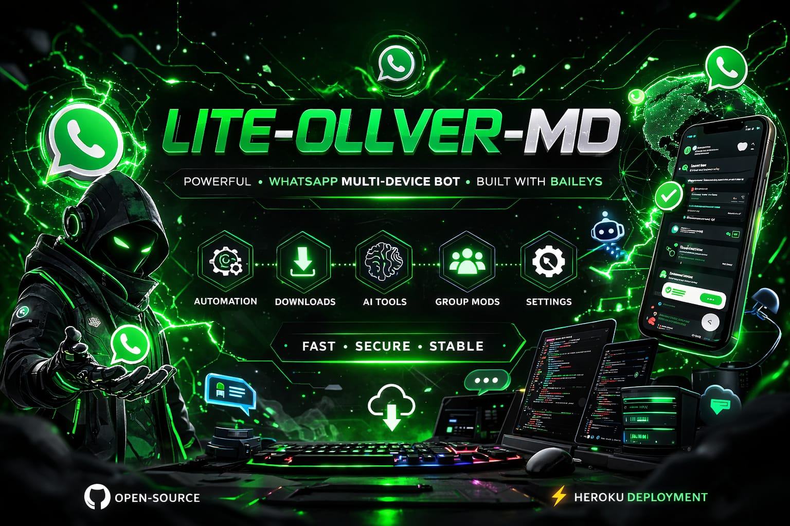

 

# Lite-Ollver-MD

### Powerful WhatsApp Multi-Device Bot

Fast • Stable • Customizable

 

---

# 🤖 Lite-Ollver-MD

Lite-Ollver-MD is a powerful **WhatsApp Multi-Device Bot** built with **Baileys**.

It supports automation, media downloads, AI utilities, group moderation and customizable commands.

---

# 🚀 Quick Start

### 1️⃣ Fork Repository

https://github.com/RichieeTechsHub/Lite-Ollver-MD/fork

---

### 2️⃣ Generate Session

Open the session generator

https://lite-ollver-session.onrender.com

Enter your WhatsApp number like this:

254740479599

Your **SESSION_ID** will be sent to your WhatsApp inbox.

---

### 3️⃣ Deploy Bot

Press the **Deploy to Heroku** button above.

You will only need to enter:

BOT_NAME  
SESSION_ID

Everything else deploys automatically.

---

# 👑 Owner

RichiieeTheeGoat

https://wa.me/254740479599

---

# 👥 Support Group

https://chat.whatsapp.com/JKF3XHbmKY47IQZc7d3LB2

---

### Lite-Ollver-MD

Built with ❤️ by **RichiieeTheeGoat**

